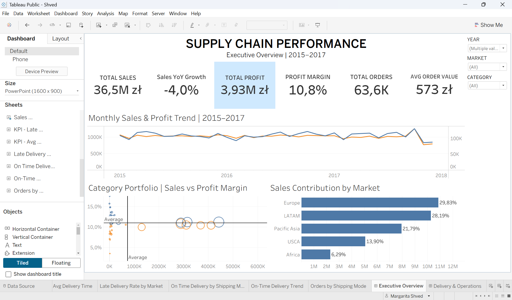

# Supply Chain Performance Analysis

## Project Overview

In this project, I analyzed supply chain data to understand the company's sales performance, profitability, and delivery efficiency.

The main goal was to identify key business and operational issues, compare performance across markets and shipping modes, and turn the results into actionable business recommendations.

I created two interactive Tableau dashboards:

- **Executive Overview** — focuses on sales, profit, profit margin, order volume, market contribution, and category performance.
- **Delivery & Operations Performance** — focuses on delivery efficiency, late deliveries, shipping modes, and operational performance.

---

## Business Questions

The analysis focuses on the following questions:

- How are sales and profit performing over time?
- Which markets contribute the most to total sales?
- How does profitability differ across product categories?
- What percentage of orders are delivered on time?
- Are delivery problems concentrated in specific markets?
- Which shipping modes perform best and worst?
- Has delivery performance improved over time?

---

## Tools Used

- **Tableau** — data visualization and interactive dashboards
- **Calculated Fields** — KPI and performance calculations
- **Data Analysis** — trend, profitability, market, and delivery analysis

---

# Dashboard 1: Executive Overview

The Executive Overview provides a high-level view of the company's financial and commercial performance.

## Key KPIs

| KPI | Result |
|---|---:|
| Total Sales | 36.5M zł |
| Total Profit | 3.93M zł |
| Profit Margin | 10.8% |
| Total Orders | 63.6K |
| Average Order Value | 573 zł |
| Sales YoY Growth | -4.0% |

## Key Insights

### 1. The company is profitable, but sales growth is slowing down

The business generated **36.5M zł in total sales** and **3.93M zł in profit**, resulting in a **10.8% profit margin**.

However, the latest YoY sales growth is **-4.0%**, which may indicate weakening sales momentum and should be monitored.

### 2. Europe and LATAM are the main sales markets

Europe contributes **29.83% of total sales**, while LATAM contributes **28.19%**.

Together, these two markets account for around **58% of total sales**, making them especially important for overall business performance.

### 3. Sales are distributed unevenly across markets

Pacific Asia contributes **21.79%**, followed by USCA at **13.90%** and Africa at **6.29%**.

This shows that the company depends more heavily on Europe and LATAM than on its smaller markets.

### 4. Category profitability varies

The category portfolio analysis shows that similar sales levels do not always generate similar profit margins.

Some categories remain around or below the average profitability level despite generating significant sales, which suggests opportunities to improve margins and product mix.

---

# Dashboard 2: Delivery & Operations Performance

The second dashboard focuses on operational efficiency and helps identify where delivery performance can be improved.

## Key KPIs

| KPI | Result |
|---|---:|
| On-Time Delivery | 45% |
| Late Delivery Rate | 55% |
| Average Delivery Time | 3.5 days |
| Total Orders | 63.6K |

## Key Insights

### 1. Delivery delays are the main operational issue

Only **45% of orders are delivered on time**, while **55% are late**.

This means that more than half of all deliveries do not meet the expected delivery time.

### 2. Delivery problems exist across all markets

Late delivery rates are very similar across markets:

- Europe — **55.2%**
- Pacific Asia — **55.0%**
- USCA — **54.8%**
- Africa — **54.6%**
- LATAM — **54.4%**

The difference between the best and worst market is less than one percentage point.

This suggests that late deliveries are not a problem of one specific market, but rather a broader operational issue.

### 3. Shipping mode has a major impact on delivery performance

There are significant differences in on-time delivery rates between shipping modes:

- Standard Class — **62%**
- Same Day — **54%**
- Second Class — **23%**
- First Class — **5%**

Standard Class performs the best, while First Class has an extremely low on-time delivery rate and should be investigated.

### 4. Standard Class handles most orders

Standard Class accounts for **38,094 orders**, significantly more than any other shipping mode.

Other shipping modes account for:

- Second Class — **12,333 orders**
- First Class — **9,751 orders**
- Same Day — **3,451 orders**

Despite handling the largest volume of orders, Standard Class also has the strongest on-time delivery performance.

### 5. Delivery performance has remained relatively stable

The on-time delivery rate stays mostly around **45–50%** throughout the analyzed period.

There is no clear long-term improvement, suggesting that delivery delays are a persistent operational problem rather than a temporary issue.

---

# Business Recommendations

Based on the analysis, I would recommend the following actions:

### 1. Investigate First Class delivery

First Class has only a **5% on-time delivery rate**, making it the weakest shipping mode by a large margin.

The company should investigate the fulfillment and transportation process behind this shipping option.

### 2. Use Standard Class as a benchmark

Standard Class combines the **highest order volume** with the **best on-time delivery performance**.

Understanding what works well in this process could help improve the performance of other shipping modes.

### 3. Focus on company-wide delivery processes

Late delivery rates are almost identical across all markets.

Instead of focusing only on individual regions, the company should review the overall fulfillment, warehouse, scheduling, and shipping processes.

### 4. Monitor the decline in sales growth

The latest YoY sales growth is **-4.0%**.

Management should monitor whether this is a temporary decline or the beginning of a longer downward trend.

### 5. Review category profitability

High sales do not always result in high profit margins.

Categories with strong revenue but below-average margins should be reviewed for potential improvements in pricing, discounts, and costs.

### 6. Set clear delivery performance targets

The current **45% on-time delivery rate** can be used as a baseline.

Setting a clear target and monitoring this KPI over time would make it easier to measure whether operational changes are actually improving delivery performance.

---

# Conclusion

This analysis shows that the company is profitable and generates strong sales, but there are two areas that require attention.

The first is the **decline in YoY sales growth**, which may become a risk if the trend continues.

The second and more significant issue is **delivery performance**. More than half of orders are delivered late, and the problem is visible across all markets.

The analysis also shows that shipping mode plays an important role in delivery performance. Standard Class performs well despite handling the largest number of orders, while First Class and Second Class show much weaker results.

Overall, the dashboards help connect financial performance with operational efficiency and highlight areas where the company could improve both profitability and customer experience.

---

## Dashboards

### Executive Overview

### Delivery & Operations Performance

---

## Author

**Margarita Shved**

Aspiring Data Analyst focused on turning data into clear business insights using SQL, Excel, Python, and Tableau.
